# 部署教程

## 界面部署

准备账号

[注册Cloudflare](https://dash.cloudflare.com/)，并添加域名

不会的可以看这个教程：[域名接入Cloudflare](https://cloud.tencent.cn/developer/article/2518586?from=15425&policyId=undefined&traceId=&frompage=seopage)

创建项目

1. 克隆仓库到自己的GitHub账号 https://github.com/maillab/cloud-mail
2. 创建worker项目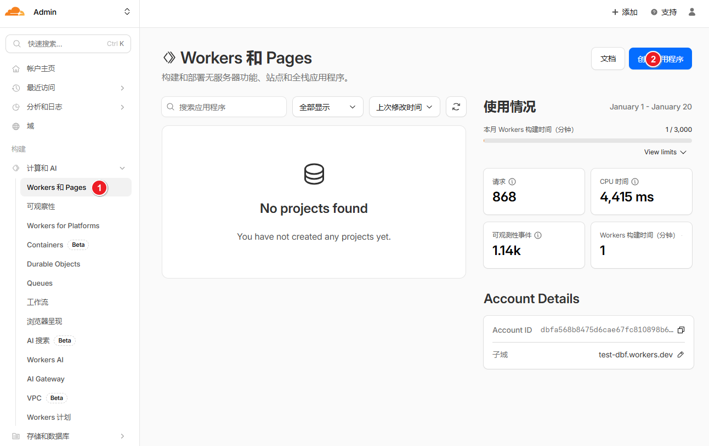
3. 选择GitHub导入
4. 设置目录 `mail-worker`，并部署

设置环境变量

| 变量名     | 必需 | 用途                                                       |
| :--------- | :--: | :--------------------------------------------------------- |
| domain     |  ✅   | 邮箱域名,多域名用（例如 `["example.com","example2.com"]`） |
| admin      |  ✅   | 管理员邮箱地址（例如 `admin@example.com`）                 |
| jwt_secret |  ✅   | JWT密钥 随便输入一串字符串，不要输入特殊字符               |

1. 设置自定义域，添加环境变量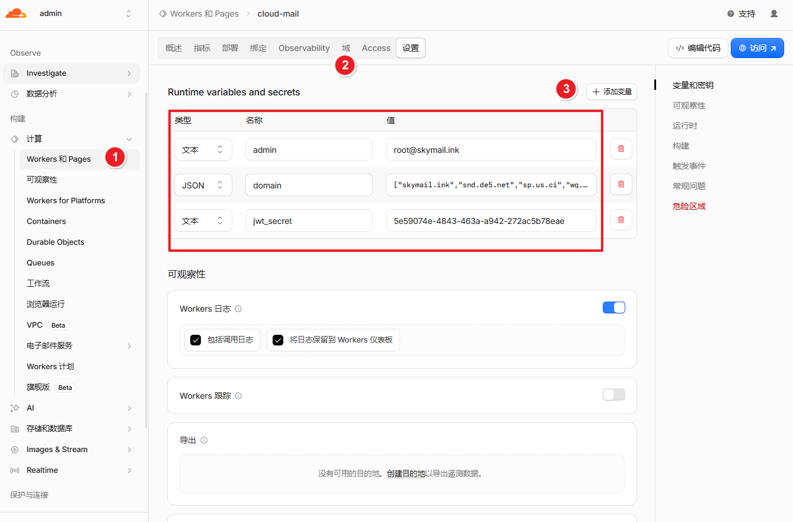

绑定数据库

1. 创建KV和D1数据库
2. 添加绑定，变量名必须为`kv`和`db`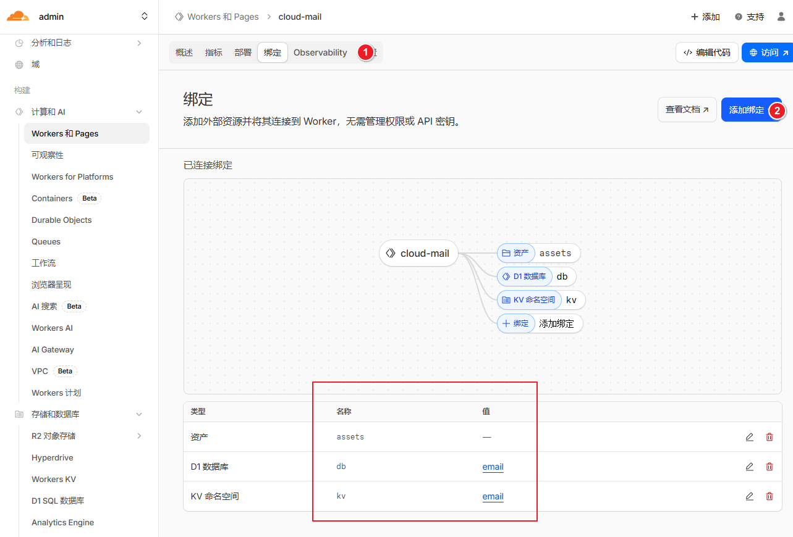

设置转发

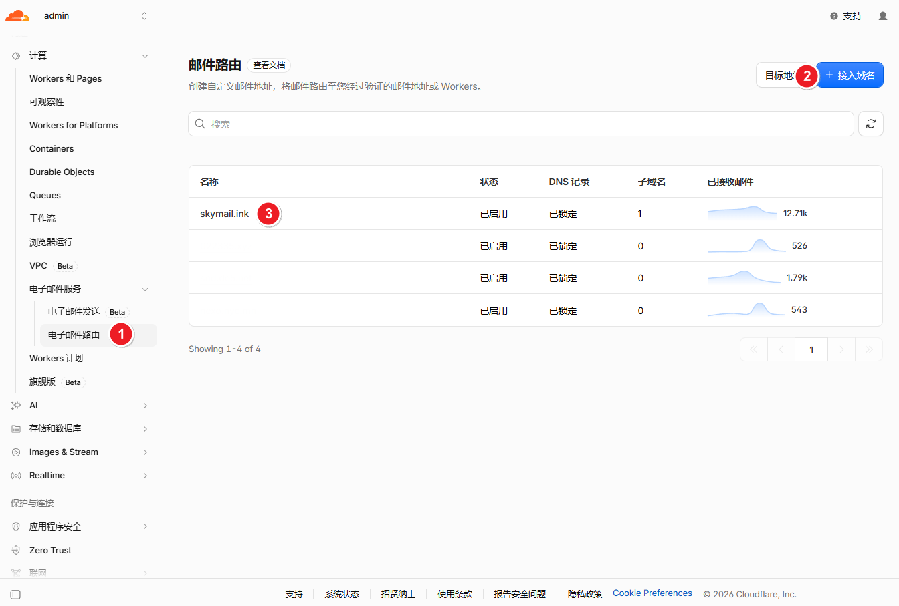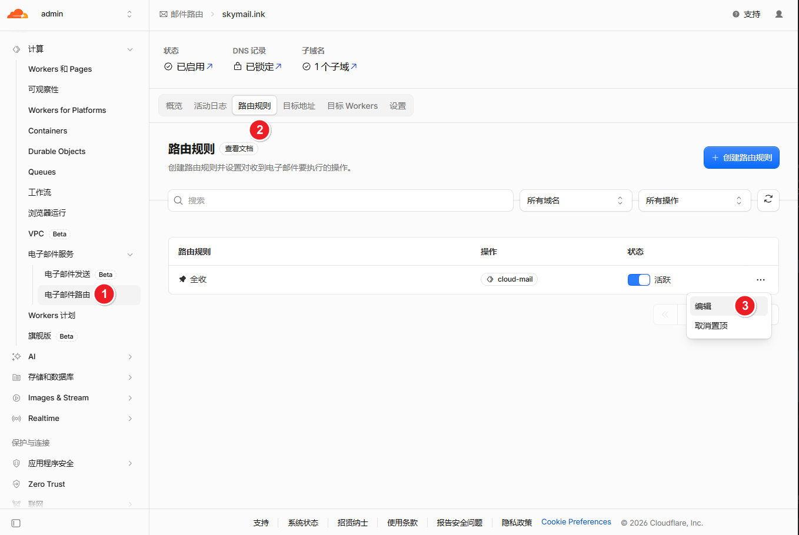

登录网站

1. 浏览器输入 `https://你的worker自定义域/api/init/你的jwt_secret` 初始化数据库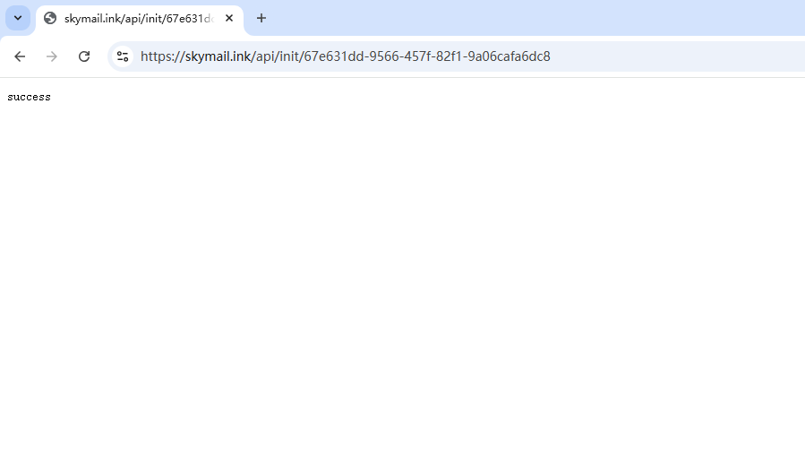
2. 浏览器输入自定义域名，注册管理员账号，登录网站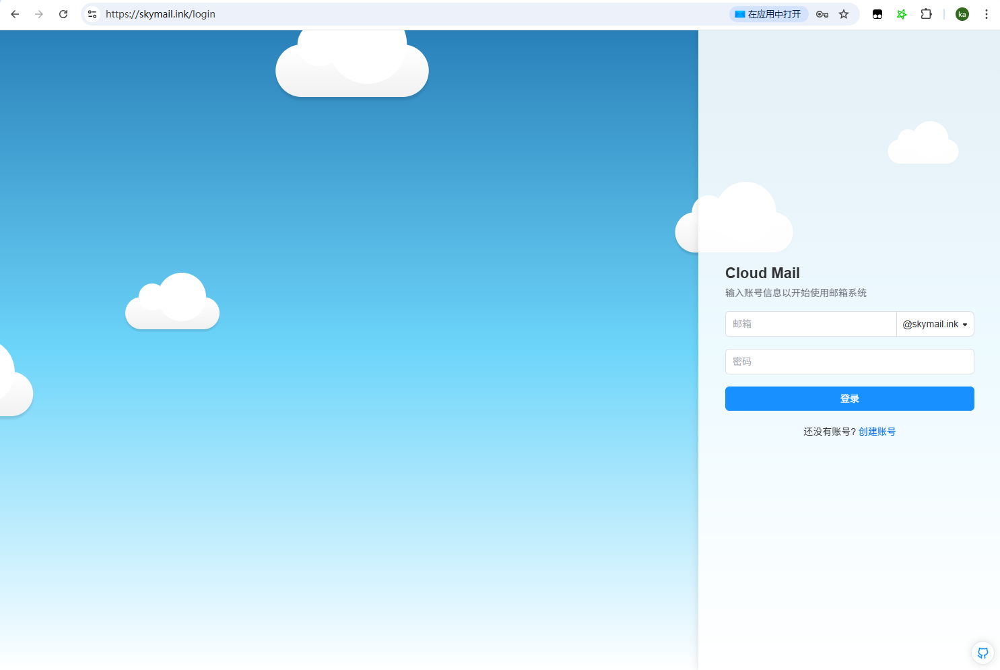

## Github Actions 部署

创建API令牌

1. [点击创建令牌](https://dash.cloudflare.com/profile/api-tokens)，选择模板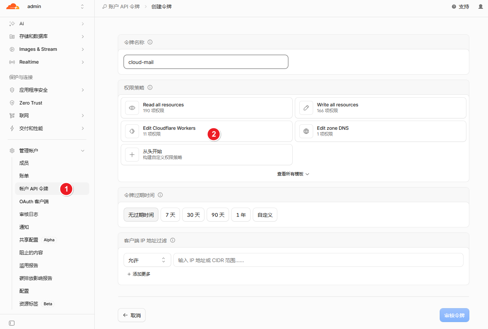
2. 添加对应权限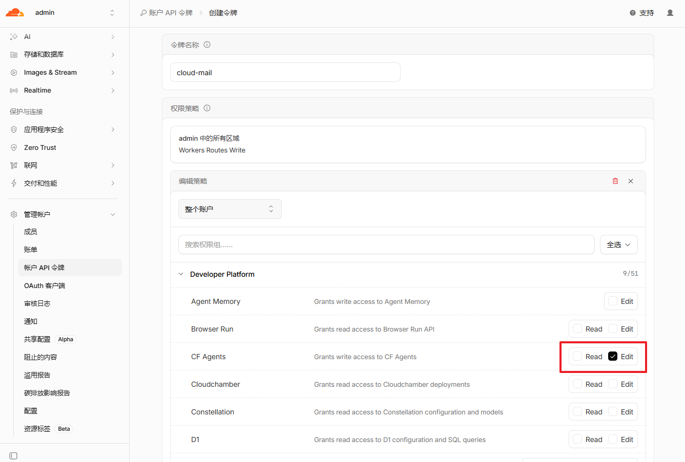
3. 复制账户ID和API令牌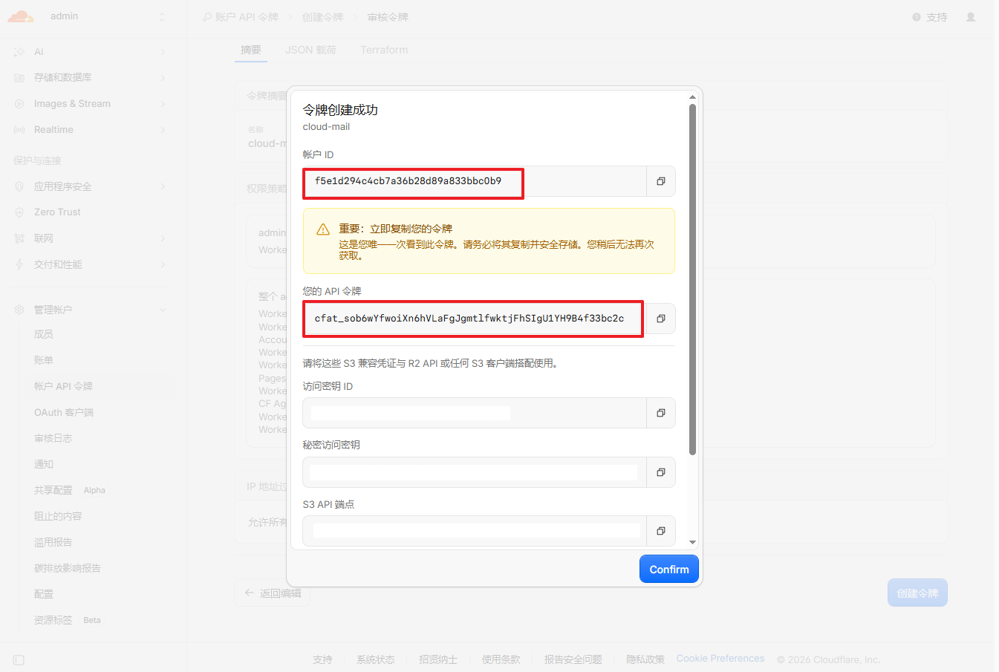

准备环境

1. Fork 克隆仓库 https://github.com/maillab/cloud-mail

   

2. 配置 Action Secret 或 Variables

| 变量名                | 必需 | 用途                                                       |
| :-------------------- | :--: | :--------------------------------------------------------- |
| CLOUDFLARE_API_TOKEN  |  ✅   | Cloudflare API 令牌                                        |
| CLOUDFLARE_ACCOUNT_ID |  ✅   | Cloudflare 账户 ID                                         |
| CUSTOM_DOMAIN         |  ✅   | 自定义域名，用来访问网站的 （例如 `skymail.ink`）          |
| DOMAIN                |  ✅   | 邮箱域名,多域名用（例如 `["example.com","example2.com"]`） |
| ADMIN                 |  ✅   | 管理员邮箱地址（例如 `admin@example.com`）                 |
| JWT_SECRET            |  ✅   | JWT密钥 随便输入一串字符串，不要输入特殊字符               |
| NAME                  |  ❌   | Worker项目名字，默认cloud-mail                             |
| D1_DATABASE_ID        |  ❌   | D1 数据库 ID ，默认使用Worker同名数据库                    |
| KV_NAMESPACE_ID       |  ❌   | KV 命名空间 ID，默认使用Worker同名数据库                   |


开始部署

1. 运行工作流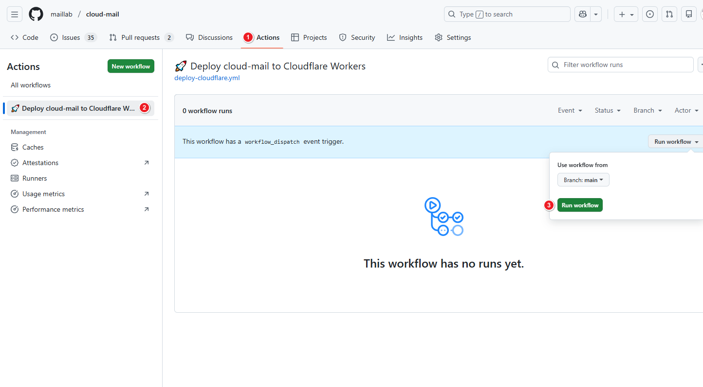
2. 等待运行完成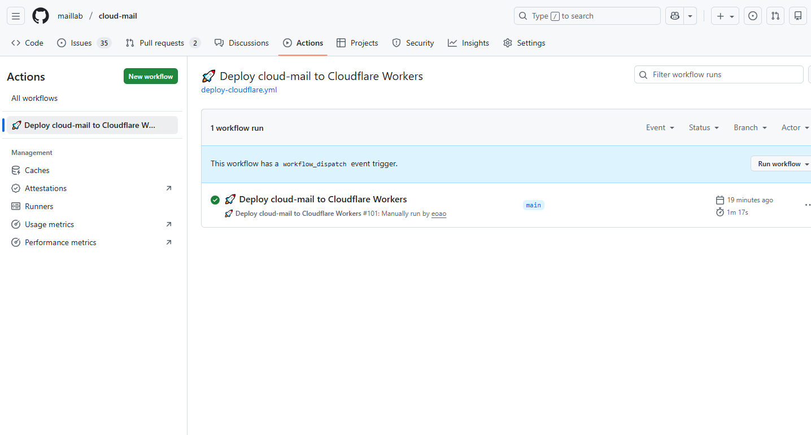

设置邮件转发

1. 参考界面部署 [设置转发](https://doc.skymail.ink/guide/dashboard.html#设置转发) 步骤
2. 浏览器输入域名，注册管理员账号，登录网站

## 命令部署教程

部署准备

Nodejs v20.19.6

Cloudflare 账号 (需要绑定域名)

**克隆项目到本地**


```
git clone https://github.com/maillab/cloud-mail #拉取代码
cd cloud-mail/mail-worker #进入worker目录
```

**安装依赖**


```
pnpm i
```

项目配置

mail-worker/wrangler.toml


```
[[d1_databases]]
binding = "db"			#d1数据库绑定名默认不可修改
database_name = ""		#d1数据库名字
database_id = ""		#d1数据库id

[[kv_namespaces]]
binding = "kv"			#kv绑定名默认不可修改
id = ""			        #kv数据库id


[[r2_buckets]]
binding = "r2"                  #r2对象存储绑定名默认不可修改
bucket_name = ""	        #r2对象存储桶的名字
	

[assets]
binding = "assets"		#静态资源绑定名默认不可修改
directory = "./dist"	        #前端vue项目打包的静态资源存放位置,默认dist

[triggers]
crons = ["0 16 * * *"]	#定时任务每天晚上12点执行（Asia/Shanghai）

[vars]
orm_log = false
domain = []			#邮件域名可以配置多个示例: ["example1.com","example2.com"]
admin = ""		        #管理员的邮箱 示例: "admin@example.com"
jwt_secret = ""			#登录身份令牌的密钥,随便填一串字符串
```

远程部署

1. 在 Cloudflare 控制台创建KV，D1数据库

2. 在项目目录 `mail-worker/wrangler.toml` 配置数据库和环境变量

3. 执行远程部署命令

   

   ```
   pnpm run deploy
   ```

4. 在Cloudflare→账户主页→你的域名→电子邮件→电子邮件路由→路由规则→Catch-all地址，编辑发送到worker

5. 浏览器输入 `https://worker自定义域/api/init/你的jwt_secret` 初始化或更新数据库

## 其他变量

| Worker Secret  | Action Secret  | 默认                           | 必需 | 用途                                        |
| :------------- | :------------- | :----------------------------- | :--: | :------------------------------------------ |
| ai_model       | AI_MODEL       | @cf/meta/llama-3.1-8b-instruct |  ❌   | AI模型                                      |
| analysis_cache | ANALYSIS_CACHE | false                          |  ❌   | 开启分析页数据缓存 (true开启 false关闭)     |
| project_link   | PROJECT_LINK   | true                           |  ❌   | 隐藏登录界面GitHub图标 (true显示 false隐藏) |

------


# 系统设置

## 邮件发送

WARNING

Cloudflare 目前不支持发件，封禁25端口，只能使用第三方服务

1. [注册Resend](https://resend.com/login)，并添加域名，完成DNS验证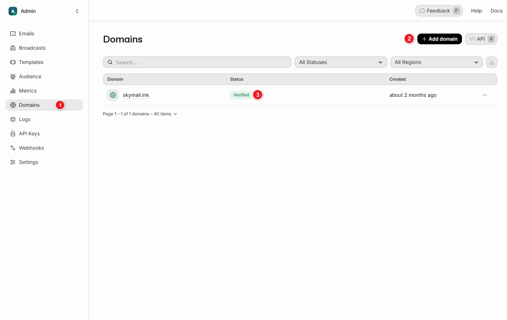

2. 创建 API Key 并复制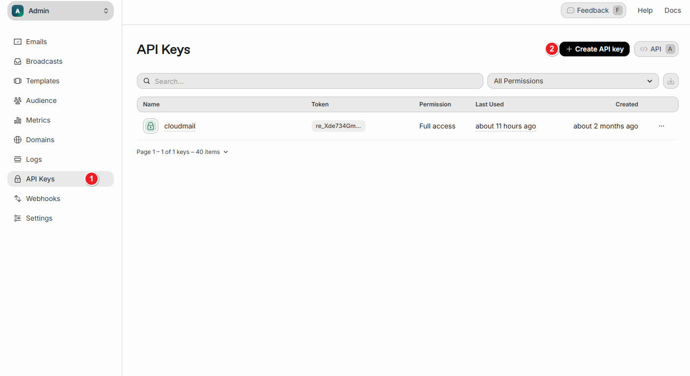

3. 设置发送状态回调 `https://worker自定义域/api/webhooks`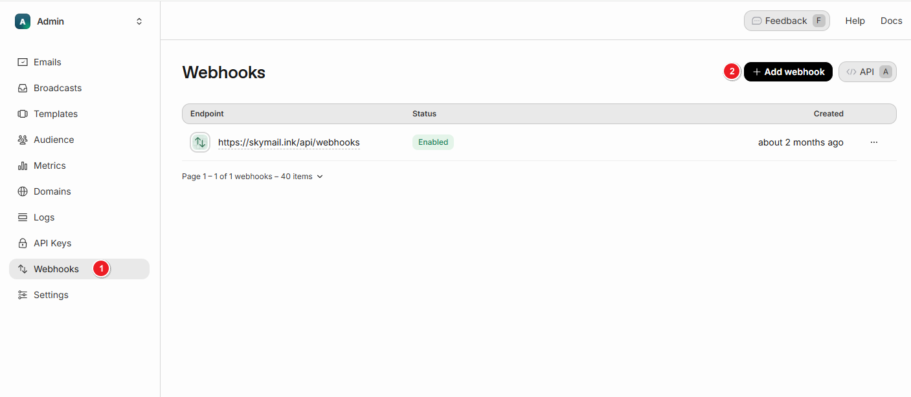

4. 选择对应选项

   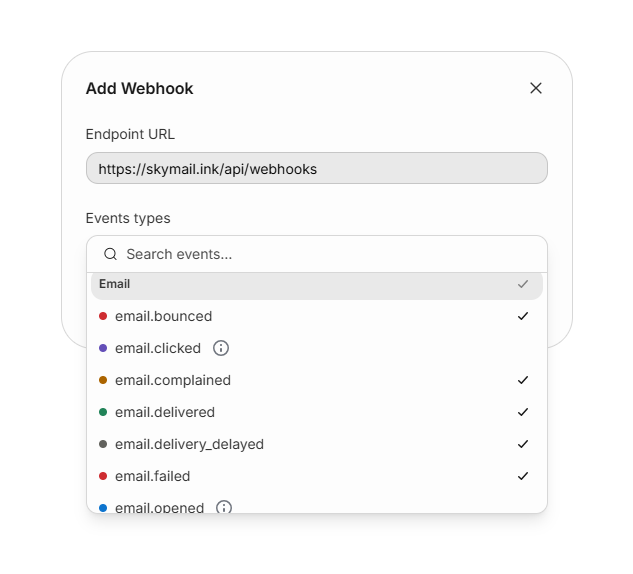

5. 系统设置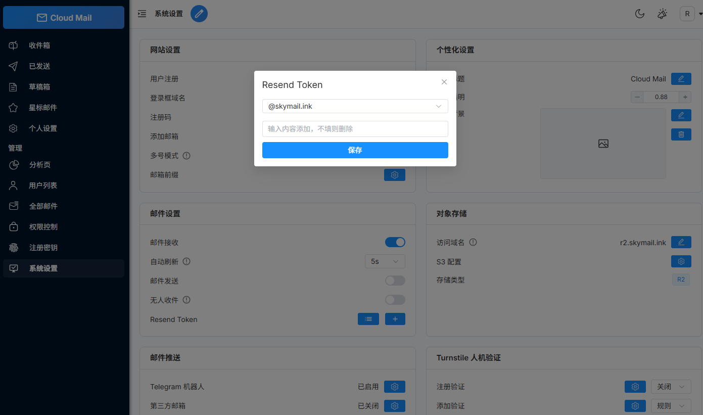


## 对象存储

WARNING

邮件附件默认使用KV存储，可以切改为R2或其他S3协议存储

1. 创建R2对象存储桶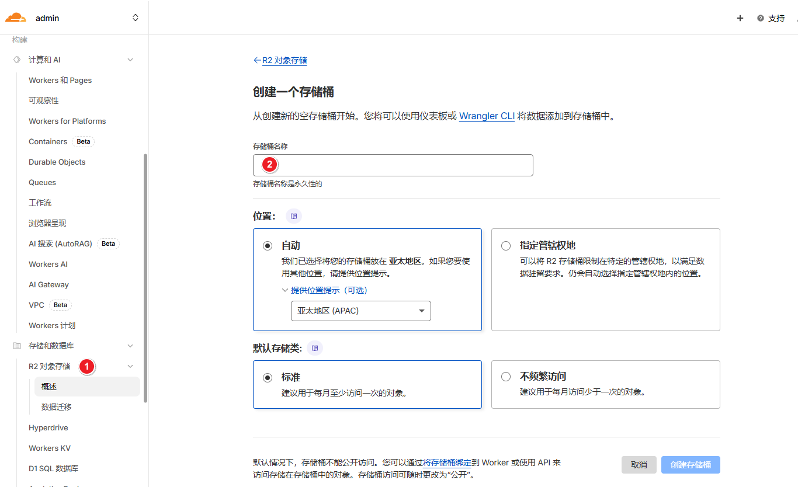
2. 设置自定义域名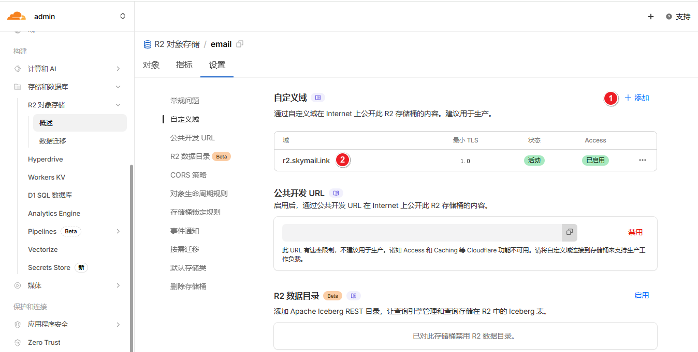
3. 添加到Action Secret 或 Worker 绑定

| Worker 绑定名称 | Action Secret  | 必需 | 用途     |
| :-------------- | :------------- | :--: | :------- |
| r2              | R2_BUCKET_NAME |  ✅   | R2桶名称 |

1. 系统设置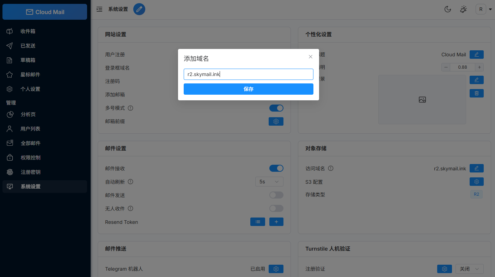

## Turnstile人机验证

1. 创建组件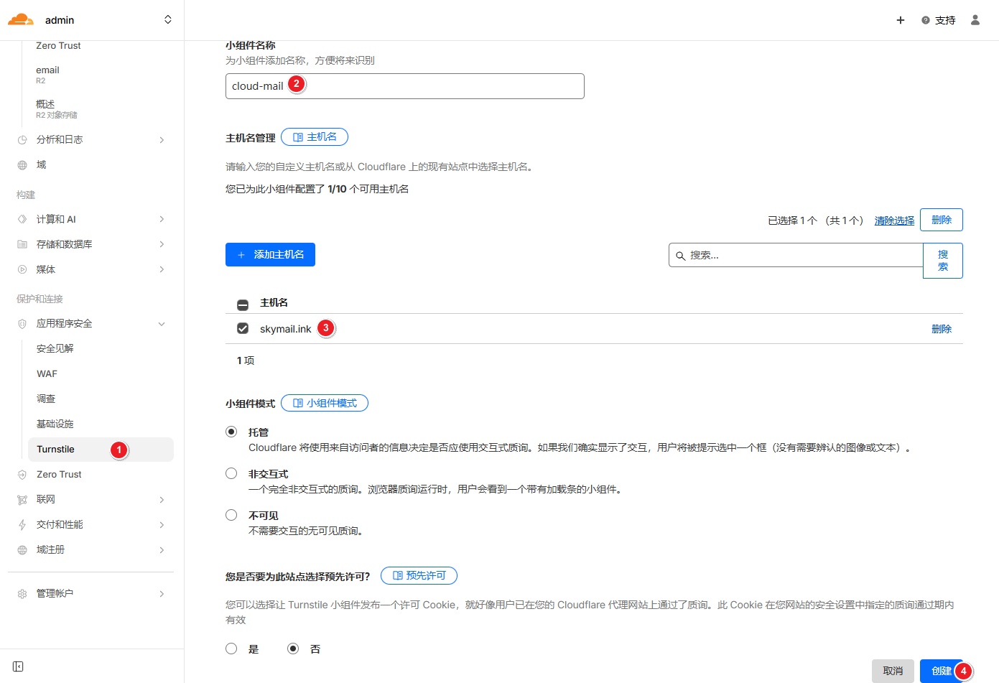
2. 创建 API Key 并复制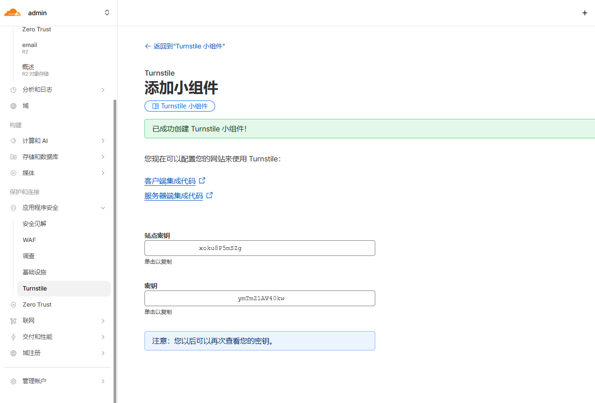
3. 系统设置

## 邮件转发

转发到TG

1. 在TG找到这个人

   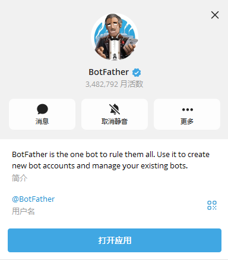

2. 创建机器人，复制Token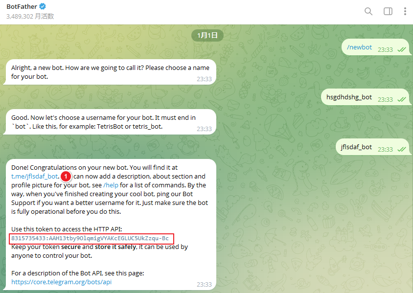

3. 给机器人发消息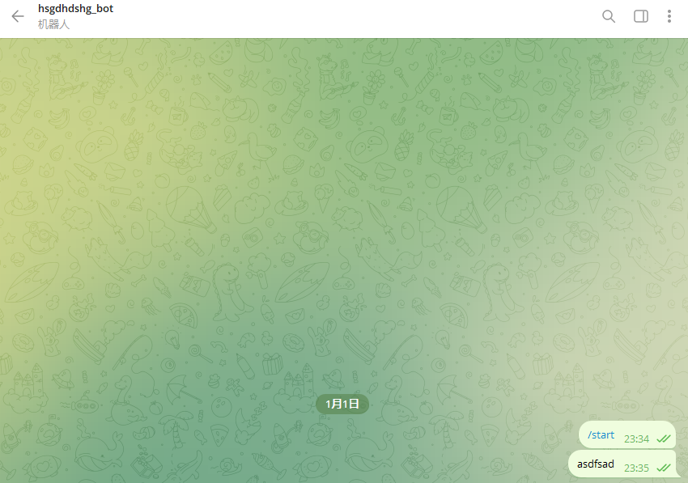

4. 浏览器输入 `https://api.telegram.org/bot`你的机器Token`/getUpdates` 获取chat_id，如果获取不到就再给机器人发几条消息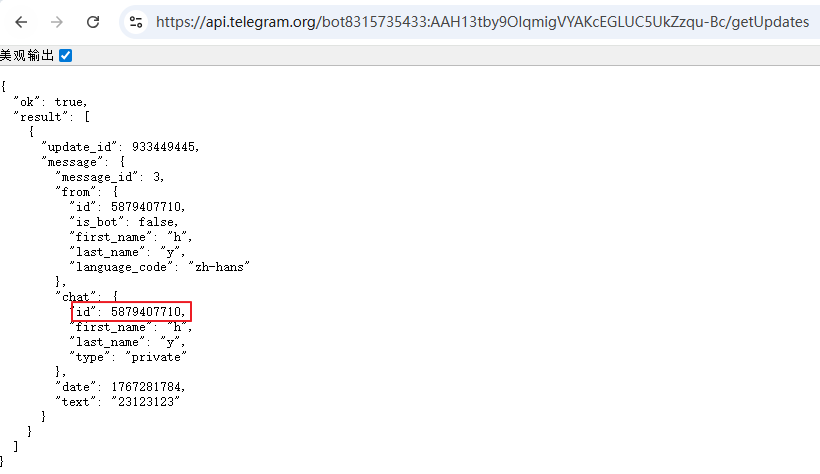

5. 系统设置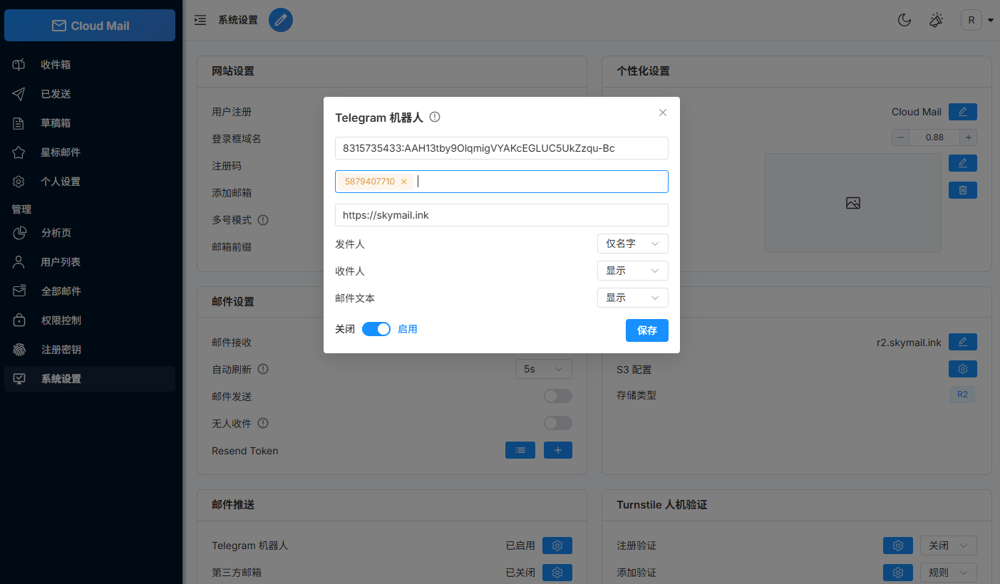

转发到其他邮箱

1. 在Cloudflare验证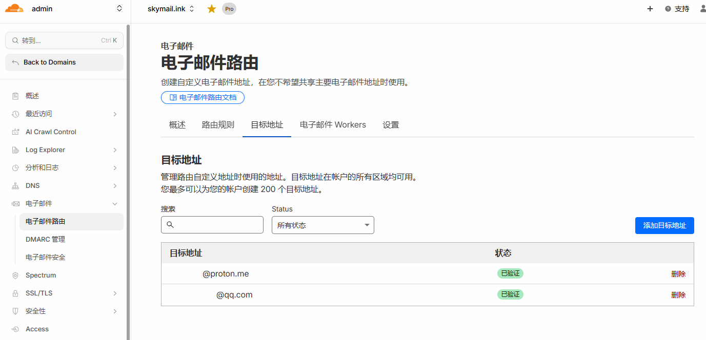
2. 系统设置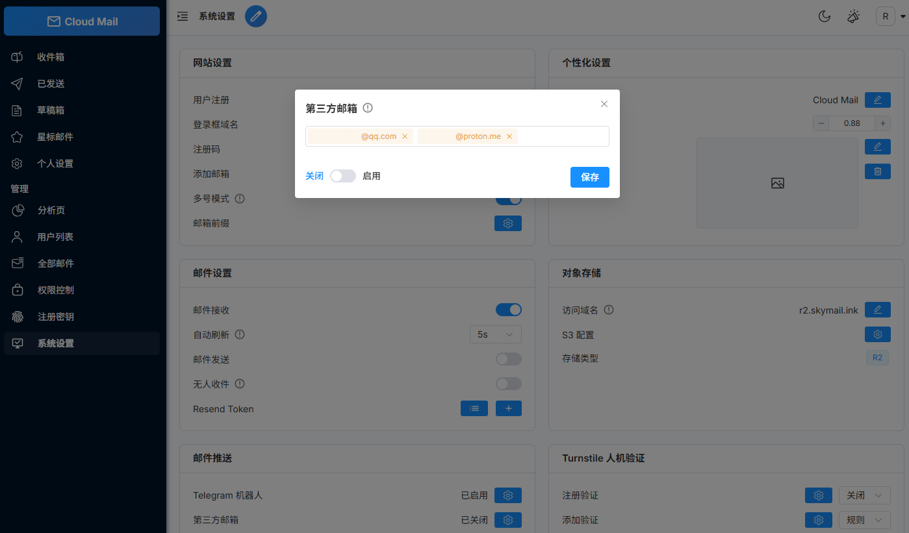

## Oathu2 登录

以Github为例

1. 在 https://github.com/settings/applications/new 创建 oauth app，
2. 回调地址设置 `https//你的worker自定义域名/login`

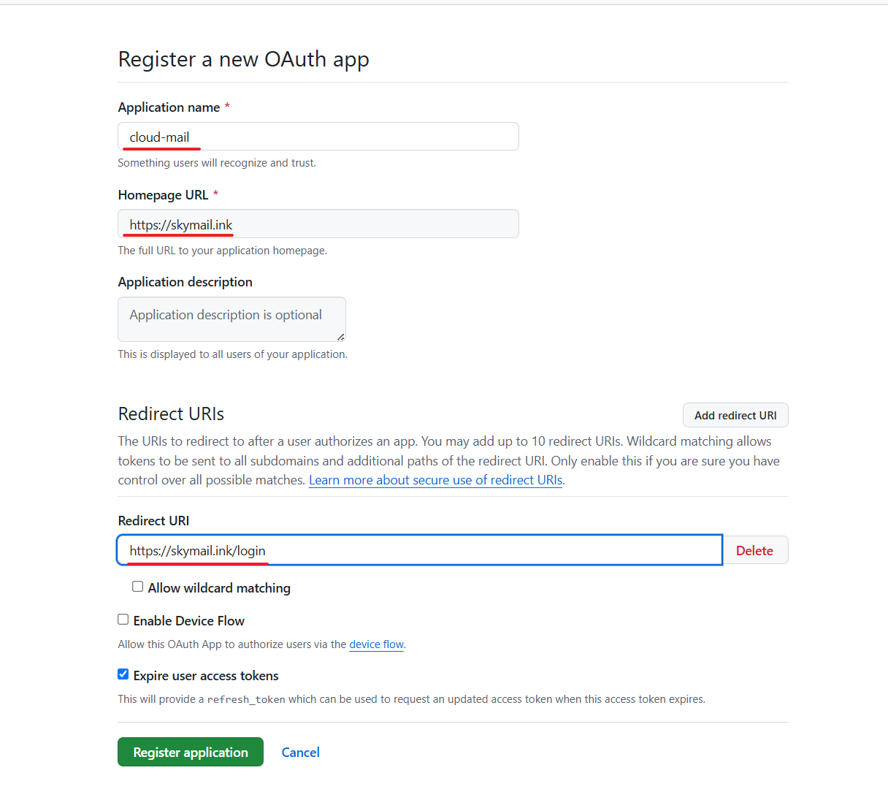

1. 创建密钥后，在系统设置添加

------


# API 接口

接口文档

TIP

除「登录」外，接口需在请求头 `Authorization` 中填入登录返回的身份令牌（不要加 Bearer 前缀）。管理类接口需要对应权限，管理员账号不受限制。

## 登录接口

### 登录

**接口说明**：使用邮箱和密码登录，返回身份令牌

**接口地址**：`POST /api/login`

请求参数

| 参数     | 类型   | 默认值 | 必填 | 说明                                   |
| :------- | :----- | :----- | :--- | :------------------------------------- |
| email    | string |        | 是   | 完整邮箱地址，例如 `admin@example.com` |
| password | string |        | 是   | 邮箱密码                               |

请求示例

```
curl -X POST "https://skymail.ink/api/login" \
  -H "Content-Type: application/json" \
  -d '{
    "email": "admin@example.com",
    "password": "password"
  }'
```

返回示例

```
{
  "code": 200,
  "message": "success",
  "data": {
      "token": "eyJhbGciOiJIUzI1NiIsInR5cCI6IkpXVCJ9..."
  }
}
```

### 当前用户信息

**接口说明**：获取当前登录用户的账号、权限身份和权限列表

**接口地址**：`GET /api/my/loginUserInfo`

请求头

| Header        | 必填 | 说明     |
| :------------ | :--- | :------- |
| Authorization | 是   | 身份令牌 |

请求示例

```
curl -X GET "https://skymail.ink/api/my/loginUserInfo" \
  -H "Authorization: YOUR_TOKEN"
```

返回示例

```
{
  "code": 200,
  "message": "success",
  "data": {
      "userId": 1,                          // 用户 id
      "email": "admin@example.com",         // 用户邮箱
      "name": "admin",                      // 用户名
      "type": 0,                            // 权限身份 id（管理员为 0）
      "sendCount": 0,                       // 已发件次数
      "permKeys": ["*"],                    // 权限列表，管理员为 ["*"]
      "account": {
          "accountId": 1,                   // 邮箱账号 id
          "email": "admin@example.com",
          "name": "admin"
      },
      "role": {
          "name": "admin",                  // 权限身份名
          "sendCount": 0,                   // 发件次数上限，0 为不限制
          "sendType": "count",              // 发件限制类型（count 总量，day 每日）
          "accountCount": 0                 // 可添加邮箱数量，0 为不限制
      }
  }
}
```

## 用户-邮件接口

### 邮件列表

**接口说明**：查询当前登录用户的邮件，使用 `emailId` 游标分页

**接口地址**：`GET /api/email/list`

请求头

| Header        | 必填 | 说明     |
| :------------ | :--- | :------- |
| Authorization | 是   | 身份令牌 |

请求参数

| 参数       | 类型    | 默认值 | 必填 | 说明                                                         |
| :--------- | :------ | :----- | :--- | :----------------------------------------------------------- |
| accountId  | integer |        | 是   | 邮箱账号 id                                                  |
| type       | integer | 0      | 否   | 邮件类型（0 收件，1 发件）                                   |
| emailId    | integer |        | 否   | 游标邮件 id，首次查询可不传。`timeSort` 为 0 时查更早的邮件，为 1 时查更晚的邮件 |
| size       | integer | 10     | 否   | 每页数量，最大 50                                            |
| timeSort   | integer |        | 否   | 时间排序（0 最新，1 最旧）                                   |
| allReceive | integer |        | 否   | 是否查询该用户全部邮箱（0 否，1 是）。不传则使用该邮箱自己的全部收取设置 |
| full       | integer | 1      | 否   | 是否返回完整字段（0 摘要，1 完整正文和附件）                 |

请求示例

```
curl -X GET "https://skymail.ink/api/email/list?accountId=1&size=10" \
  -H "Authorization: YOUR_TOKEN"
```

返回示例

```
{
  "code": 200,
  "message": "success",
  "data": {
    "total": 1,
    "latestEmail": {
      "emailId": 999,
      "accountId": 1,
      "userId": 1
    },
    "list": [
      {
        "emailId": 999,                       // 邮件 id
        "sendEmail": "hello@example.com",     // 发件人邮箱
        "name": "hello",                      // 发件人名字
        "subject": "Hello word",              // 邮件主题
        "toEmail": "admin@example.com",       // 收件人邮箱
        "accountId": 1,                       // 邮箱账号 id
        "type": 0,                            // 邮件类型（0 收件，1 发件）
        "status": 0,                          // 邮件状态（0 收件，1 已发送，2 已送达，3 退信，4 投诉，5 延迟，6 保存中，7 无人收件，8 失败）
        "unread": 0,                          // 是否未读（0 未读，1 已读）
        "isDel": 0,                           // 是否删除（0 正常，1 已删除）
        "isStar": 0,                          // 是否星标（0 否，1 是）
        "content": "<div>Hello word</div>",   // 邮件 HTML，full=1 时返回
        "text": "Hello word",                 // 邮件纯文本
        "createTime": "2099-12-30 23:59:59",  // 接收或发送时间（UTC）
        "attList": [                          // 附件列表，full=1 时返回
          {
            "attId": 1,
            "filename": "file.txt",
            "mimeType": "text/plain",
            "size": 1024
          }
        ]
      }
    ]
  }
}
```

### 发送邮件

**接口说明**：使用当前用户的邮箱账号发件。附件最多 10 个，正文内嵌图片最多 10 张

**接口地址**：`POST /api/email/send`

请求头

| Header        | 必填 | 说明     |
| :------------ | :--- | :------- |
| Authorization | 是   | 身份令牌 |

请求参数

| 参数           | 类型           | 默认值 | 必填 | 说明                                                |
| :------------- | :------------- | :----- | :--- | :-------------------------------------------------- |
| accountId      | integer        |        | 是   | 发件邮箱账号 id                                     |
| receiveEmail   | array <string> |        | 是   | 收件人邮箱列表                                      |
| subject        | string         |        | 是   | 邮件主题                                            |
| content        | string         |        | 是   | 邮件 HTML                                           |
| text           | string         |        | 否   | 邮件纯文本                                          |
| name           | string         |        | 否   | 发件人名字，不填自动截取邮箱前缀                    |
| sendType       | string         |        | 否   | 发件类型（空 新邮件，`reply` 回复，`forward` 转发） |
| emailId        | integer        |        | 否   | 原邮件 id，`sendType` 为 `reply` 时必填             |
| attachments    | array <object> |        | 否   | 附件列表                                            |
| └─ filename    | string         |        | 是   | 文件名                                              |
| └─ content     | string         |        | 是   | 文件内容，Base64                                    |
| └─ contentType | string         |        | 否   | 文件 MIME 类型                                      |
| └─ size        | integer        |        | 否   | 文件大小                                            |

请求示例

```
curl -X POST "https://skymail.ink/api/email/send" \
  -H "Authorization: YOUR_TOKEN" \
  -H "Content-Type: application/json" \
  -d '{
    "accountId": 1,
    "name": "admin",
    "receiveEmail": ["hello@example.com"],
    "subject": "Hello word",
    "content": "<div>Hello word</div>",
    "text": "Hello word",
    "sendType": "",
    "attachments": [
      {
        "filename": "file.txt",
        "contentType": "text/plain",
        "content": "SGVsbG8gd29yZA=="
      }
    ]
  }'
```

返回示例

```
{
  "code": 200,
  "message": "success",
  "data": [
    {
      "emailId": 999,                         // 邮件 id
      "sendEmail": "admin@example.com",       // 发件人邮箱
      "name": "admin",                        // 发件人名字
      "subject": "Hello word",                // 邮件主题
      "content": "<div>Hello word</div>",     // 邮件 HTML
      "text": "Hello word",                   // 邮件纯文本
      "type": 1,                              // 邮件类型（1 发件）
      "status": 1,                            // 邮件状态（1 已发送，2 已送达）
      "accountId": 1,
      "userId": 1,
      "createTime": "2099-12-30 23:59:59",
      "attList": []
    }
  ]
}
```

### 删除邮件

**接口说明**：删除当前用户的邮件。默认标记删除，系统开启同步删除时为永久删除

**接口地址**：`DELETE /api/email/delete`

请求头

| Header        | 必填 | 说明     |
| :------------ | :--- | :------- |
| Authorization | 是   | 身份令牌 |

请求参数

| 参数     | 类型   | 默认值 | 必填 | 说明                        |
| :------- | :----- | :----- | :--- | :-------------------------- |
| emailIds | string |        | 是   | 邮件 id，多个用英文逗号分隔 |

请求示例

```
curl -X DELETE "https://skymail.ink/api/email/delete?emailIds=1,2" \
  -H "Authorization: YOUR_TOKEN"
```

返回示例

```
{
  "code": 200,
  "message": "success",
  "data": null
}
```

## 用户-邮箱地址

### 邮箱列表

**接口说明**：查询当前登录用户的邮箱地址，按置顶顺序分页

**接口地址**：`GET /api/account/list`

请求头

| Header        | 必填 | 说明     |
| :------------ | :--- | :------- |
| Authorization | 是   | 身份令牌 |

请求参数

| 参数      | 类型    | 默认值 | 必填 | 说明                                                         |
| :-------- | :------ | :----- | :--- | :----------------------------------------------------------- |
| size      | integer |        | 否   | 每页数量，最大 30                                            |
| accountId | integer |        | 否   | 游标邮箱 id，首次查询可不传                                  |
| lastSort  | integer |        | 否   | 游标排序值，首次查询可不传。下一页传入上一页最后一条的 `sort` 和 `accountId` |

请求示例

```
curl -X GET "https://skymail.ink/api/account/list?size=15" \
  -H "Authorization: YOUR_TOKEN"
```

返回示例

```
{
  "code": 200,
  "message": "success",
  "data": [
    {
      "accountId": 1,                         // 邮箱账号 id
      "email": "admin@example.com",           // 邮箱地址
      "name": "admin",                        // 邮箱名称
      "userId": 1,                            // 所属用户 id
      "allReceive": 0,                        // 是否全部收取（0 否，1 是）
      "sort": 0,                              // 排序值，越大越靠前
      "isDel": 0,                             // 是否删除（0 正常，1 已删除）
      "createTime": "2099-12-30 23:59:59"     // 创建时间
    }
  ]
}
```

### 添加邮箱

**接口说明**：为当前用户添加邮箱地址。邮箱域名必须是已配置的邮箱域名，不能添加已存在或已注销的地址

**接口地址**：`POST /api/account/add`

请求头

| Header        | 必填 | 说明     |
| :------------ | :--- | :------- |
| Authorization | 是   | 身份令牌 |

请求参数

| 参数  | 类型   | 默认值 | 必填 | 说明                                       |
| :---- | :----- | :----- | :--- | :----------------------------------------- |
| email | string |        | 是   | 完整邮箱地址，例如 `hello@example.com`     |
| token | string |        | 否   | 人机验证 token，系统开启添加邮箱验证时必填 |

请求示例

```
curl -X POST "https://skymail.ink/api/account/add" \
  -H "Authorization: YOUR_TOKEN" \
  -H "Content-Type: application/json" \
  -d '{
    "email": "hello@example.com"
  }'
```

返回示例

```
{
  "code": 200,
  "message": "success",
  "data": {
    "accountId": 2,                           // 邮箱账号 id
    "email": "hello@example.com",             // 邮箱地址
    "name": "hello",                          // 邮箱名称，自动截取邮箱前缀
    "userId": 1,
    "allReceive": 0,
    "sort": 0,
    "isDel": 0,
    "createTime": "2099-12-30 23:59:59",
    "addVerifyOpen": false                    // 下次添加是否需要人机验证
  }
}
```

### 删除邮箱

**接口说明**：删除当前用户的邮箱。不能删除登录主邮箱。默认标记删除，系统开启同步删除时为永久删除

**接口地址**：`DELETE /api/account/delete`

请求头

| Header        | 必填 | 说明     |
| :------------ | :--- | :------- |
| Authorization | 是   | 身份令牌 |

请求参数

| 参数      | 类型    | 默认值 | 必填 | 说明        |
| :-------- | :------ | :----- | :--- | :---------- |
| accountId | integer |        | 是   | 邮箱账号 id |

请求示例

```
curl -X DELETE "https://skymail.ink/api/account/delete?accountId=2" \
  -H "Authorization: YOUR_TOKEN"
```

返回示例

```
{
  "code": 200,
  "message": "success",
  "data": null
}
```

## 管理-用户列表

### 用户列表

**接口说明**：分页查询用户，可按邮箱、状态、删除状态筛选

**接口地址**：`GET /api/user/list`

请求头

| Header        | 必填 | 说明     |
| :------------ | :--- | :------- |
| Authorization | 是   | 身份令牌 |

请求参数

| 参数     | 类型    | 默认值 | 必填 | 说明                                                         |
| :------- | :------ | :----- | :--- | :----------------------------------------------------------- |
| num      | integer | 1      | 否   | 页码                                                         |
| size     | integer | 50     | 否   | 每页数量，最大 50                                            |
| email    | string  |        | 否   | 邮箱，前缀模糊匹配                                           |
| timeSort | integer |        | 否   | 时间排序（0 最新，1 最旧）                                   |
| status   | integer |        | 否   | 用户状态（0 正常，1 禁用）。传 0 或 1 时只返回未删除用户，不传或 -1 不按状态过滤 |
| isDel    | integer |        | 否   | 是否删除（0 正常，1 已删除）                                 |

请求示例

```
curl -X GET "https://skymail.ink/api/user/list?num=1&size=50" \
  -H "Authorization: YOUR_TOKEN"
```

返回示例

```
{
  "code": 200,
  "message": "success",
  "data": {
    "total": 1,
    "list": [
      {
        "userId": 1,                          // 用户 id
        "email": "admin@example.com",         // 用户邮箱
        "type": 0,                            // 权限身份 id（管理员为 0）
        "status": 0,                          // 用户状态（0 正常，1 禁用）
        "isDel": 0,                           // 是否删除（0 正常，1 已删除）
        "sendCount": 0,                       // 已发件次数
        "createTime": "2099-12-30 23:59:59",  // 注册时间
        "activeTime": "2099-12-30 23:59:59",  // 最近活跃时间
        "createIp": "127.0.0.1",              // 注册 IP
        "activeIp": "127.0.0.1",              // 最近活跃 IP
        "os": "Windows",                      // 操作系统
        "browser": "Chrome",                  // 浏览器
        "device": "Desktop",                  // 设备
        "receiveEmailCount": 10,              // 收件数量
        "sendEmailCount": 2,                  // 发件数量
        "accountCount": 1,                    // 邮箱数量
        "delReceiveEmailCount": 0,            // 已删除收件数量
        "delSendEmailCount": 0,               // 已删除发件数量
        "delAccountCount": 0,                 // 已删除邮箱数量
        "username": null,                     // 第三方登录用户名
        "name": null,                         // 第三方登录昵称
        "avatar": null,                       // 第三方登录头像
        "platform": null,                     // 第三方登录平台
        "trustLevel": null,                   // 第三方登录信任等级
        "sendAction": {
          "hasPerm": true,                    // 是否有发件权限
          "sendType": "count",                // 发件限制类型（count 总量，day 每日）
          "sendCount": 0                      // 发件次数上限，0 为不限制
        }
      }
    ]
  }
}
```

### 添加用户

**接口说明**：管理员添加用户，邮箱域名必须是已配置的邮箱域名，密码至少 6 位

**接口地址**：`POST /api/user/add`

请求头

| Header        | 必填 | 说明     |
| :------------ | :--- | :------- |
| Authorization | 是   | 身份令牌 |

请求参数

| 参数     | 类型   | 默认值 | 必填 | 说明                                  |
| :------- | :----- | :----- | :--- | :------------------------------------ |
| email    | string |        | 是   | 完整邮箱地址，例如 `user@example.com` |
| password | string |        | 是   | 密码，至少 6 位                       |

请求示例

```
curl -X POST "https://skymail.ink/api/user/add" \
  -H "Authorization: YOUR_TOKEN" \
  -H "Content-Type: application/json" \
  -d '{
    "email": "user@example.com",
    "password": "password"
  }'
```

返回示例

```
{
  "code": 200,
  "message": "success",
  "data": null
}
```

### 修改状态

**接口说明**：启用或禁用用户，禁用后该用户所有登录会话会失效

**接口地址**：`PUT /api/user/setStatus`

请求头

| Header        | 必填 | 说明     |
| :------------ | :--- | :------- |
| Authorization | 是   | 身份令牌 |

请求参数

| 参数   | 类型    | 默认值 | 必填 | 说明                       |
| :----- | :------ | :----- | :--- | :------------------------- |
| userId | integer |        | 是   | 用户 id                    |
| status | integer |        | 是   | 用户状态（0 正常，1 禁用） |

请求示例

```
curl -X PUT "https://skymail.ink/api/user/setStatus" \
  -H "Authorization: YOUR_TOKEN" \
  -H "Content-Type: application/json" \
  -d '{
    "userId": 1,
    "status": 1
  }'
```

返回示例

```
{
  "code": 200,
  "message": "success",
  "data": null
}
```

### 删除用户

**接口说明**：永久删除用户及其邮箱、邮件、星标和第三方登录绑定，不可恢复

**接口地址**：`DELETE /api/user/delete`

请求头

| Header        | 必填 | 说明     |
| :------------ | :--- | :------- |
| Authorization | 是   | 身份令牌 |

请求参数

| 参数    | 类型   | 默认值 | 必填 | 说明                        |
| :------ | :----- | :----- | :--- | :-------------------------- |
| userIds | string |        | 是   | 用户 id，多个用英文逗号分隔 |

请求示例

```
curl -X DELETE "https://skymail.ink/api/user/delete?userIds=1,2" \
  -H "Authorization: YOUR_TOKEN"
```

返回示例

```
{
  "code": 200,
  "message": "success",
  "data": null
}
```

## 管理-邮件列表

### 邮件列表

**接口说明**：查询全部用户的邮件，使用 `emailId` 游标分页，可按类型、发件人、主题、用户邮箱、收发邮箱筛选

**接口地址**：`GET /api/allEmail/list`

请求头

| Header        | 必填 | 说明     |
| :------------ | :--- | :------- |
| Authorization | 是   | 身份令牌 |

请求参数

| 参数         | 类型    | 默认值    | 必填 | 说明                                                         |
| :----------- | :------ | :-------- | :--- | :----------------------------------------------------------- |
| emailId      | integer |           | 否   | 游标邮件 id，首次查询可不传。`timeSort` 为 0 时查更早的邮件，为 1 时查更晚的邮件 |
| size         | integer | 10        | 否   | 每页数量，最大 50                                            |
| timeSort     | integer |           | 否   | 时间排序（0 最新，1 最旧）                                   |
| type         | string  | `receive` | 否   | 邮件类型（`all` 全部，`receive` 收件，`send` 发件，`delete` 已删除，`noone` 无人收件） |
| name         | string  |           | 否   | 发件人名字，前缀模糊匹配                                     |
| subject      | string  |           | 否   | 邮件主题，前缀模糊匹配                                       |
| userEmail    | string  |           | 否   | 所属用户邮箱，前缀模糊匹配                                   |
| accountEmail | string  |           | 否   | 发件人或收件人邮箱，前缀模糊匹配                             |
| full         | integer | 1         | 否   | 是否返回完整字段（0 摘要，1 完整正文和附件）                 |

请求示例

```
curl -X GET "https://skymail.ink/api/allEmail/list?type=receive&size=10" \
  -H "Authorization: YOUR_TOKEN"
```

返回示例

```
{
  "code": 200,
  "message": "success",
  "data": {
    "total": 1,
    "latestEmail": {
      "emailId": 999,                         // 最新一封收件 id，用于轮询刷新
      "accountId": 1,
      "userId": 1
    },
    "list": [
      {
        "emailId": 999,                       // 邮件 id
        "sendEmail": "hello@example.com",     // 发件人邮箱
        "name": "hello",                      // 发件人名字
        "subject": "Hello word",              // 邮件主题
        "toEmail": "admin@example.com",       // 收件人邮箱
        "toName": "admin",                    // 收件人名字
        "userEmail": "admin@example.com",     // 所属用户邮箱
        "accountId": 1,                       // 邮箱账号 id
        "userId": 1,                          // 所属用户 id
        "type": 0,                            // 邮件类型（0 收件，1 发件）
        "status": 0,                          // 邮件状态（0 收件，1 已发送，2 已送达，3 退信，4 投诉，5 延迟，6 保存中，7 无人收件，8 失败）
        "unread": 0,                          // 是否未读（0 未读，1 已读）
        "isDel": 0,                           // 是否删除（0 正常，1 已删除）
        "content": "<div>Hello word</div>",   // 邮件 HTML，full=1 时返回
        "text": "Hello word",                 // 邮件纯文本
        "cc": "[]",                           // 抄送
        "bcc": "[]",                          // 密送
        "createTime": "2099-12-30 23:59:59",  // 接收或发送时间（UTC）
        "attList": [                          // 附件列表，full=1 时返回
          {
            "attId": 1,
            "filename": "file.txt",
            "mimeType": "text/plain",
            "size": 1024
          }
        ]
      }
    ]
  }
}
```

### 删除邮件

**接口说明**：永久删除指定邮件及其附件、星标，不可恢复

**接口地址**：`DELETE /api/allEmail/delete`

请求头

| Header        | 必填 | 说明     |
| :------------ | :--- | :------- |
| Authorization | 是   | 身份令牌 |

请求参数

| 参数     | 类型   | 默认值 | 必填 | 说明                        |
| :------- | :----- | :----- | :--- | :-------------------------- |
| emailIds | string |        | 是   | 邮件 id，多个用英文逗号分隔 |

请求示例

```
curl -X DELETE "https://skymail.ink/api/allEmail/delete?emailIds=1,2" \
  -H "Authorization: YOUR_TOKEN"
```

返回示例

```
{
  "code": 200,
  "message": "success",
  "data": null
}
```

## 管理-注册码

### 注册码列表

**接口说明**：查询全部注册码，可按注册码前缀筛选。已过期的注册码 `expireTime` 返回 `null`

**接口地址**：`GET /api/regKey/list`

请求头

| Header        | 必填 | 说明     |
| :------------ | :--- | :------- |
| Authorization | 是   | 身份令牌 |

请求参数

| 参数 | 类型   | 默认值 | 必填 | 说明                 |
| :--- | :----- | :----- | :--- | :------------------- |
| code | string |        | 否   | 注册码，前缀模糊匹配 |

请求示例

```
curl -X GET "https://skymail.ink/api/regKey/list?code=Ab12" \
  -H "Authorization: YOUR_TOKEN"
```

返回示例

```
{
  "code": 200,
  "message": "success",
  "data": [
    {
      "regKeyId": 1,                          // 注册码 id
      "code": "Ab12Cd34",                     // 注册码
      "count": 10,                            // 剩余使用次数
      "roleId": 1,                            // 权限身份 id
      "roleName": "普通用户",                  // 权限身份名
      "userId": 1,                            // 创建人用户 id
      "expireTime": "2099-12-30 00:00:00",    // 有效期，已过期为 null
      "createTime": "2099-12-30 23:59:59"     // 创建时间
    }
  ]
}
```

### 添加注册码

**接口说明**：创建注册码。注册码不能重复，使用该注册码注册的用户会获得对应权限身份

**接口地址**：`POST /api/regKey/add`

请求头

| Header        | 必填 | 说明     |
| :------------ | :--- | :------- |
| Authorization | 是   | 身份令牌 |

请求参数

| 参数       | 类型    | 默认值 | 必填 | 说明                      |
| :--------- | :------ | :----- | :--- | :------------------------ |
| code       | string  |        | 是   | 注册码                    |
| roleId     | integer |        | 是   | 权限身份 id               |
| count      | integer |        | 是   | 可使用次数                |
| expireTime | string  |        | 是   | 有效期，例如 `2099-12-30` |

请求示例

```
curl -X POST "https://skymail.ink/api/regKey/add" \
  -H "Authorization: YOUR_TOKEN" \
  -H "Content-Type: application/json" \
  -d '{
    "code": "Ab12Cd34",
    "roleId": 1,
    "count": 10,
    "expireTime": "2099-12-30"
  }'
```

返回示例

```
{
  "code": 200,
  "message": "success",
  "data": null
}
```

### 使用记录

**接口说明**：查询使用该注册码完成注册的用户列表

**接口地址**：`GET /api/regKey/history`

请求头

| Header        | 必填 | 说明     |
| :------------ | :--- | :------- |
| Authorization | 是   | 身份令牌 |

请求参数

| 参数     | 类型    | 默认值 | 必填 | 说明      |
| :------- | :------ | :----- | :--- | :-------- |
| regKeyId | integer |        | 是   | 注册码 id |

请求示例

```
curl -X GET "https://skymail.ink/api/regKey/history?regKeyId=1" \
  -H "Authorization: YOUR_TOKEN"
```

返回示例

```
{
  "code": 200,
  "message": "success",
  "data": [
    {
      "email": "user@example.com",            // 注册用户邮箱
      "createTime": "2099-12-30 23:59:59"     // 注册时间
    }
  ]
}
```

### 删除注册码

**接口说明**：删除指定注册码

**接口地址**：`DELETE /api/regKey/delete`

请求头

| Header        | 必填 | 说明     |
| :------------ | :--- | :------- |
| Authorization | 是   | 身份令牌 |

请求参数

| 参数      | 类型   | 默认值 | 必填 | 说明                          |
| :-------- | :----- | :----- | :--- | :---------------------------- |
| regKeyIds | string |        | 是   | 注册码 id，多个用英文逗号分隔 |

请求示例

```
curl -X DELETE "https://skymail.ink/api/regKey/delete?regKeyIds=1,2" \
  -H "Authorization: YOUR_TOKEN"
```

返回示例

```
{
  "code": 200,
  "message": "success",
  "data": null
}
```